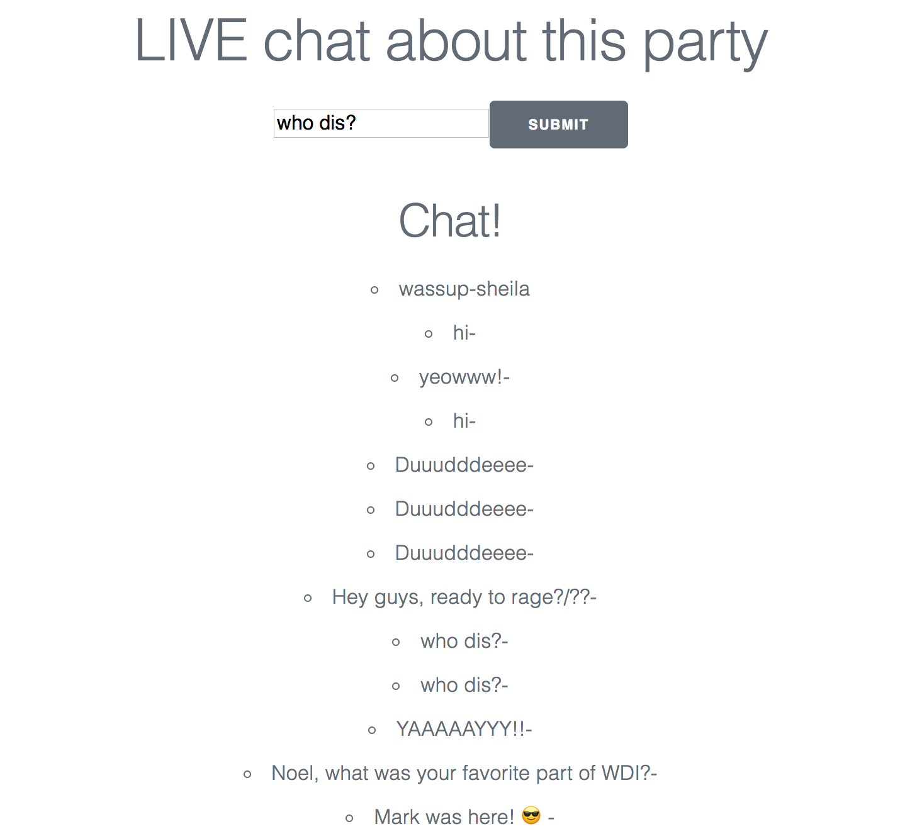

# Partyparty

### Necessary Deliverables

* A **working API**, hosted somewhere on the internet
* A **working front-end**, hosted somewhere on the internet
* A **link to your hosted working app** in the URL section of your Github repo
* A **git repository hosted on Github**, with a link to your hosted project, and frequent commits dating back to the very beginning of the project
* **A ``readme.md`` file** with:
    * An embedded screenshot of the app
    * Explanations of the **technologies** used
    * A couple paragraphs about the **general approach you took**
    * **Installation instructions** for any dependencies
    * Link to your **user stories** – who are your users, what do they want, and why?
    * Link to your **wireframes** – sketches of major views / interfaces in your application
    * **OPTIONAL**: Link to your **pitch deck** – documentation of your wireframes, user stories, and proposed architecture
    * Descriptions of any **unsolved problems** or **major hurdles** you had to overcome

--
###Description

This app is designed to help you make parties and invite your friends. It includes a special feature where you live chat about the party using socket.io. 

Check out the app [here:](https://tranquil-reaches-93920.herokuapp.com/users/5a97215e5340540014dd200c
) 

###Technologies Used: 

Front-end:

* React.js
* JavaScript
* HTML
* CSS

Back-end:

* Node.js
* Socket.io
* MongoDB

(To see all npm packages used, please go to the package.json file both in the main directory and in the client directory)

--

###General Approach

1. Ideation
2. Planning
3. Make MVP socket.io chat with React
4. Build backend
5. Build front-end with React. 

**Here's the trello board: **
https://trello.com/b/PladwX3R/party-party-project-4

-write more here about this experience

--

### Installation Instructions

To start out, you can go [here:](https://tranquil-reaches-93920.herokuapp.com/users/5a97215e5340540014dd200c
) 

If you'd like to run the repo locally, follow these instructions: 

1. Clone this repo locally
2. Run an npm install 
3. In 2 new tabs on your terminal, run nodemon and mongod. 
4. In a third new tab on your terminal, navigate to the client directory and run npm start. 

--

###User Stories

--

###WireFrames

--

